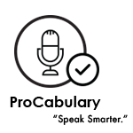

<!--   -->
ProCabulary is wearable-mobile app pair that take advantage of continuous speech capture technology to help people expand vocabulary in their professional industries and speak like a professional. 

Duration: 2020.01-2020.03 (11 weeks)

My Role: In charge of user research, usability testing, and ​design the user flows and user interfaces.

Methods: User Research, Contextual Inquiry, Heuristic Evaluation, Task Analysis, Usability Testing, Information Architecture

Tools: Figma, Photoshop, Illustrator

Project also credit to **Arjun Malhotra, Karron Bansal and Francis Wang**

---

### Overview

<blockquote>
    People new to their fields struggle to understand the technical jargon and integrate it into their speech. To address this problem, we designed ProCabulary: a wearable-mobile app pair that utilizes continuous speech capture technology to help people expand vocabulary in their fields and speak like a professional. 
</blockquote>

For people new to their professional fields, understanding the professional language that their colleagues are using and improving their fluency in that language can be quite challenging. **Our problem is, how do we get people to master sophisticated and specialized jargon and information in professional industries at a quicker pace?** 

Our solution is to develop a wearable-mobile app pair: the wearable captures speech when prompted, and the smartphone app offers insights, analysis, and ways to help the users improve their vocabulary, through both understanding new words and using those words in their conversations.  

### Design Process
Throughout the 10-week course, my team and I structured our research and design process following an iterative design process.

### User Research
To better understand our target users: people who have problems in improving vocabulary in their fields, we conducted interviews with them to understand their concerns, worries, and expectations.

**Research Findings Summary**
From the interviews we conducted, we compiled 4 main research takeaways:
* People initially had trouble comprehending sophisticated jargon unique to their specific environment.
* The issues and concerns of collecting new information from intellectual discussions with peers and colleagues in their respective fields were also universally expressed across all our participants.
* the process of incorporating technical terminologies consistently in one's everyday speech is rather slow.
* People were also seemingly curious about similarities and differences in their speech among different settings of daily conversations.

### Task Analysis

**Identified Tasks**

Based on the insights from our user research, we listed out the main tasks that embody the objectives our target audience want to accomplish and the particular needs they have: 

**Task 1: Identify and compile new terms and vocabulary**

4 interviewees all expressed their concerns to quickly comprehend and extract important terms in fast-paced intellectual discussions.

**Task 2: Review and study identified vocabulary**

The majority of our interviewees told us that they have to review and memorize them constantly. Their solutions to this issue are constantly reminding themselves to review the materials they've studied.

**Task 3: Integrate vocabulary into daily conversations**

The process of remembering and integrating newly-gathered information into their speech is too slow to be practical without any external forces. They constantly find it difficult to naturally incorporate those words into <u>appropriate contexts</u>.

**Task 4: Identify places for improvements**

Even though our participants have spent time reviewing and extracting important information, they always lack a clear goal to enhance and hone their skills, let alone where they are heading to.

**Task 5: Reflect on changes and process**

We discovered that reinforcing good behaviors and improvements by offering small, staged rewards, even psychological rewards, can help users accomplish their goals one by one and create a sense of achievement for them to proceed further.

### Ideation

**Design Ideas**

Based on the tasks and research results, we came up with 3 ideas that address different tasks.

After weighing all the pros and cons, we chose to combine the second and third designs. Together, these 2 designs address a majority of goals we identified from our participants: pinpointing new terms and vocabularies, reviewing and getting familiarized with those new words/info, and evaluating their progress.

The combined design contains a wearable to support audio recording as well as a smartphone for data presentation. Smartphones make analysis and reflection on those captured data much easier, and wearable allows for a less intrusive method of continuous speech capture. 

<blockquote>
Learning a new language can be intimidating, we want to make the process quicker and smoother.
</blockquote>

**Scenario**

### Prototype

**Initial Paper Prototype**

**User Testing**

Our testing process includes 3 heuristic evaluations, 2 design critiques, and 3 usability tests of out paper prototype with our target participants who have particular requirements to master their sophisticated and specialized jargon and information in their professional realms. We also applied participatory design method in iterating and refining our prototype.

**Heuristic Evaluation & Usability Testing**

In the testing process, after a brief introduction of the system and our study, we asked our participants to attempt to finish 2 of our primary tasks:
1. Record conversation and review identified vocabulary.
2. Review suggestions for speech improvements.

In each test, we were assigned certain roles including the facilitator, the "computer", and the note taker. Asking the participants to "think it aloud" helped us understand our participants' interpretation of the system.

  
  

**Design Critique**

In the evaluation workshop, we received design critiques from our 2 TAs, regarding the goal setup process. Their questions where instructive and enlightening for us, as it pushed us to think thoroughly and profoundly in terms of the pivotal goal-setting process and its potential influence on users' following actions.

**Major Issues**

**Iterations**

We decided to revise our design by addressing the issues identified by our participants and then test for another round.

**Set up specified status and goals**

**Rearrange the homepage content**

**Make the progress more tangible**

**Add practice feature**

**New strategy: trial week**

**Final Paper Prototype**

**Digital Prototype**

---

<h3 style="color:white;"> Set up your profile</h3>

<h3 style="color:white;"> Adjustment to timeline</h3>

<h3 style="color:white;"> Review compiled conversations</h3>

<h3 style="color:white;"> Practice professional conversations</h3>

### Reflection

Getting feedback from our target audience helped us tremendously in refining the interface design and workflow. Personalized goals setting, less-steep learning curve and encouragement for practices are all key qualities that our participants value, and those qualities should be emphasized in the next iteration. Moving forward, I also want to dig into the visual design of the weekly statistical report, which is shown in the homepage and timeline page. A visually-appealing and effective report would help users keep track of their progress and encourage them to perform better. 

More details can be found on the project's [website](https://courses.cs.washington.edu/courses/cse440/20wi/projects/procabulary/):