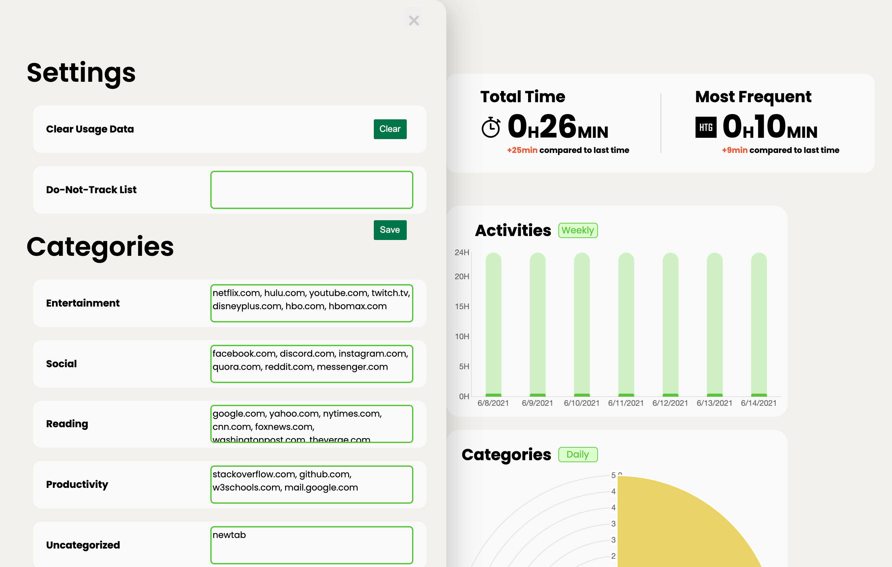

 UserAnalytics is a lightweight Chrome extension that allows users to easily view their Chrome usage trends. Through stylized and interactive visualizations, they should be able to see what domains they visit the most, the volume of internet usage throughout the day or week, and the time for each category of website. User can choose to opt-in or -out of tracking and has the full capability to customize their tracking list based on their preferences. We want UserAnalytics to be easy to use and install, allow user customization in domain tracking, store data securely, and be respectful of users’ privacy. [Github repo](https://github.com/patrick-sharp/UserAnalytics)

Duration: 2021.04-2021.06 (10 weeks)

My Role: software and architecture design, user requirements analysis, UI design, front-end user interaction, graphs and data report. 

Tools: Git, GitHub Action, JavaScript, HTML, CSS, Chrome

Project also credits to Richard Jiang, Yukai Yan, Nikhil Sharma and Patrick Sharp.

---

### Main Feature

**Stretch Goals**

1. Focus/Relax mode that can be suggested on/off based on user actions(ML) or manually turn on/off.
2. Block sites at certain times, set time limits for certain sites.
3. ✅ User can customize the categorization of their browsing habits by associating specific domains with specific categories of website (e.g. associating `bitbucket` with the `Productivity` category) 
4. ✅  Users can clear their browsing data from our extension's storage at any time. 

### Use Cases

Case1: User wants to check his sage for each domain.

Case2: User wants to check his usage for each day of the week.

Case3: User wants to see their browsing habits hatched by category(e.g. social, productivity, entertainment).

Case4: User wants to configure their track list for domain tracking.

### Non-functional Requirements

1. UserAnalytics will protect its users' privacy by only storing browsing data for up to 1 week. The user's data will be securely stored through `Chrome Sync storage`.
2. UserAnalytics will correctly collect and represent a user's data, so as not to mislead them with false visualizations and conclusions.
3. UserAnalytics will have an intuitive user interface, have minimal impact on performance of Chrome, and have close to real-time updates on the visualizations.

### Software Architecture
 
**Major Components**
- Chrome Background Script: Listens to tab changes and records timestamps.
- Middleware Functions: Using timestamp information from background script and Chrome storage, calculate time spent on a website to store into Chrome storage.
- Dashboard Processing and UI: Uses middleware functions to read time spent information from storage and displays in a graph.

**Interfaces**
- Background Script to Middleware: Script calls function in middleware to update last visited domain, with a timestamp.
- Middleware to Chrome Storage: Uses Chrome APIs to read and/or write to Chrome's local storage.
- Dashboard UI to Middleware: Dashboard calls functions in middleware to grab time spent data for graphing.

### Testing and Tooling
Our testing and tooling is based around using GitHub Actions for CI. It uses the Node.js runtime to run a program that tests our `middleware` functions automatically when we push or open a pull request to the main branch of our repository. We try to stay minimal in development strategy (i.e. using `VanillaJS` for all development), but this decision made testing harder, because the majority of the support for CI on `JavaScript` is based on `Node.js`. It is also hard to configure testing infrastructure to do unit testing on user interfaces in general. But testing Chrome extension in Chrome is a headache for us. We need to mimics lots of Chrome behaviors in our testing infrastructure. Eventually we decided to adopt `IFNDEF`-like checks and mock Chrome APIs to make sure the testing would work on GitHub Action. 

### UI Design

Style Guide

Main Interface

  
  

### Reflection
This [software engineering course](https://homes.cs.washington.edu/~rjust/courses/2021Spring/CSE403/index.html) changed a lot of my superficial and mistaken ideas towards software engineering in general. 

The very first concept introduced in the lecture was understanding use cases and requirements, which are closely related to future software design, planning, and specifications. Retrospectively, I wish I had known this concept ahead of time. A comprehensive understanding of requirements and use cases allows developers to generate crystal clear goals and plans in a structural way, such as a doable project timeline, reasonable architecture design, and specifications, thus making fewer mistakes and critical changes during development. Understanding *what* our product should do and will be able to do instead of *how* the system should work gave the entire team some edges in product design and feature implementation to meet those requirements and use cases. However, during this process, there were some avoidable miscommunications in the backend team that caused troubles when we started the software implementation process. For future software projects, I will ask myself to understand precisely what is required of the software and then communicate this understanding accurately to everyone in the team before heading towards the next steps.

Another concept introduced in the lecture is regarding tooling and team management, including build system, continuous integration, and version control. This group of concepts surprised me a lot and the lecture corrected many of the wrong ideas I had earlier. For example, I thought of the build system as a simple program that compiles a bunch of source code together(e.g. Java files across multiple folders) and runs the compiled version. Later I realized that this notion covers only a small portion of the responsibilities of a build system. A build system is also responsible for running static analysis, performing testing and installing any dependencies, shipping code to production, and more. One concept from Professor Just deeply resonated with me, which says, 
>as a software engineer, we should orchestrate tasks through automatic systems and reduce the amount of manual work as much as possible. 

Although a build system didn’t quite fit the project I was working on due to the limitations posed by Google’s Chrome ecosystem, I still spent some of the time working with the team to take advantage of the Github Action for CI system. A robust CI system did help the team to catch hidden issues under hundreds of lines of commits, which otherwise would break the entire extension system very easily. I will continue to follow the concept of the build system and CI for projects in the future.

Overall I think I learned a lot from this course and the project process through all the stages of the software life cycle, which reinforced some of the core concepts in software engineering. This course reminds me that writing good code is not enough. We need to equip ourselves with tools to make maintainable software and be able to communicate with others in a team.

---

  
Click to view design draft!

    <iframe style="border: 1px solid rgba(0, 0, 0, 0.1);" width="800" height="450" src="https://www.figma.com/embed?embed_host=share&url=https%3A%2F%2Fwww.figma.com%2Ffile%2Fzm6dGgsUf1aPi1X8LkQ7Ib%2FUser-Analytics%3Fnode-id%3D0%253A1" allowfullscreen></iframe>

To view more details on this project, visit our [full documentation](https://docs.google.com/document/d/e/2PACX-1vTy0gjtqAEoS-mZjNC28KlrHzFBkOaT2SbEpFtk3C2mDbZ8k5NZXElmuR3JBlqdaevg-dnxvOrgyA6o/pub)

